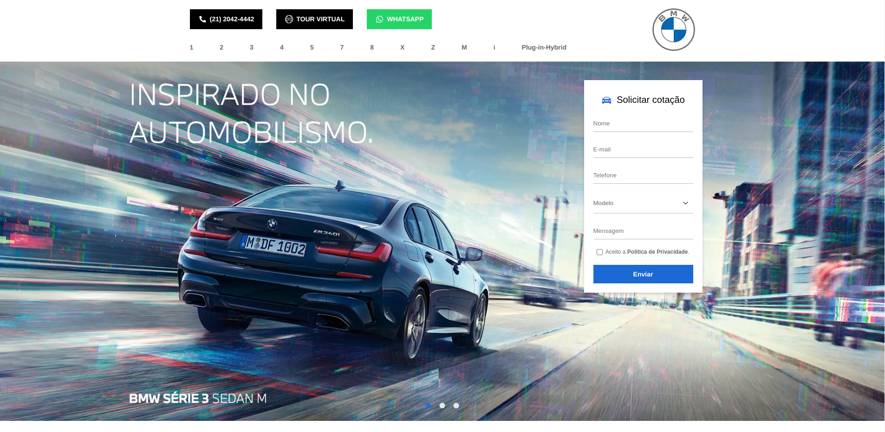

<h1 align="center">
    
</h1>

<p align="center">
  <a href="#-technologies">Technologies</a>&nbsp;&nbsp;&nbsp;|&nbsp;&nbsp;&nbsp;
  <a href="#-preview">Preview</a>&nbsp;&nbsp;&nbsp;|&nbsp;&nbsp;&nbsp;
  <a href="#-Getting-started">Getting started</a>&nbsp;&nbsp;&nbsp;|&nbsp;&nbsp;&nbsp;
  <a href="#-project">Project</a>
</p>

## 🧪 Technologies

This project was developed using the following technologies:

- [ReactJs](https://nextjs.org/)
- [TypeScript](https://www.typescriptlang.org/)

## 🔥 Preview

[](https://teste-alpes-one.pricarrenho.com.br)

## 🚀 Getting started

Clone the project and access the folder

```bash
$ git clone https://github.com/pricarrenho/alpes-one && cd alpes-one
```

Follow the steps below

```bash
# Install the dependencies
$ npm install

# Start the project
$ npm run dev

```

Or with Yarn

```bash
# Install the dependencies
$ yarn install

# Start the project
$ yarn dev

```

## 💻 Project

[Teste - Alpes One](https://teste-alpes-one.pricarrenho.com.br) was developed to validate knowledge in ReactJs.

<br/>

---

<p align="center">
Made with 💜 by <a href="https://www.pricarrenho.com.br">Priscilla Carrenho</a> 
</p>
